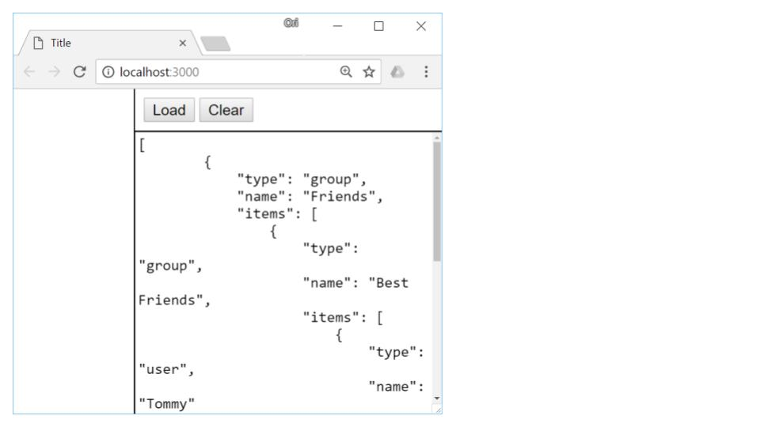
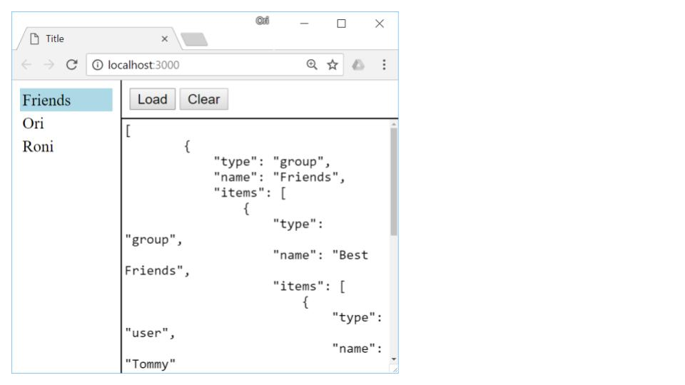
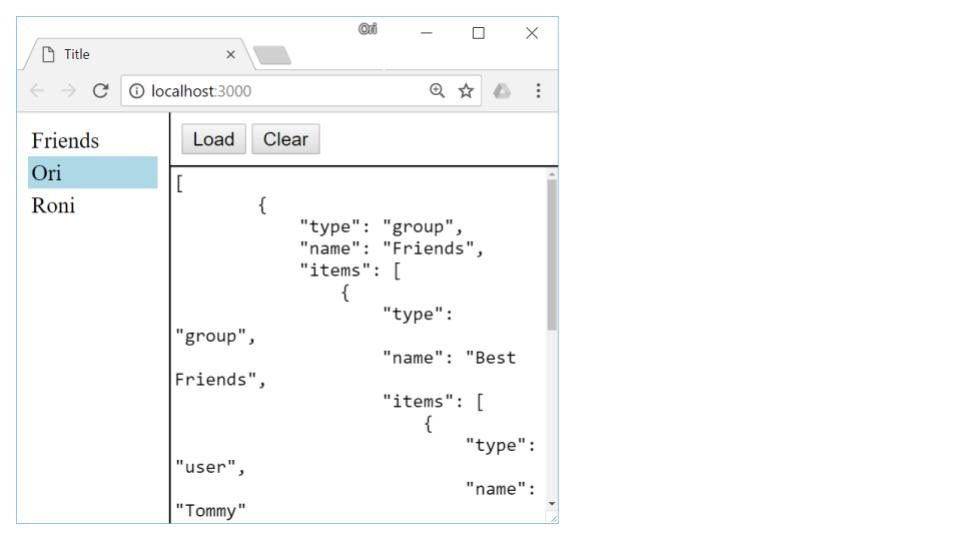
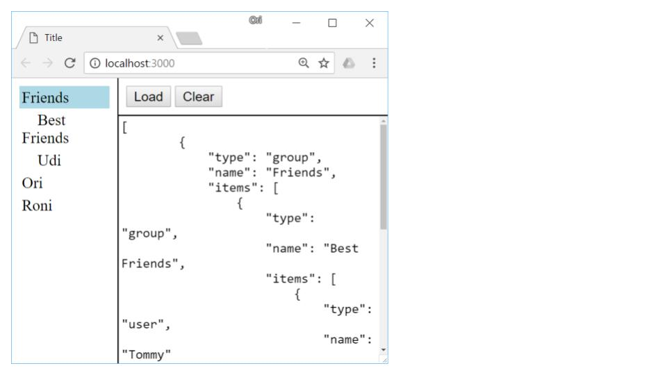
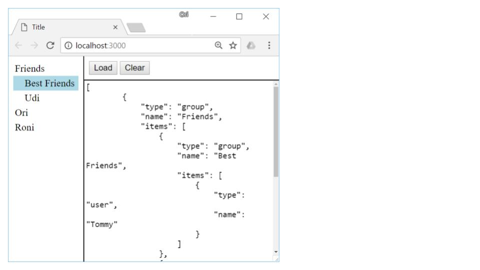
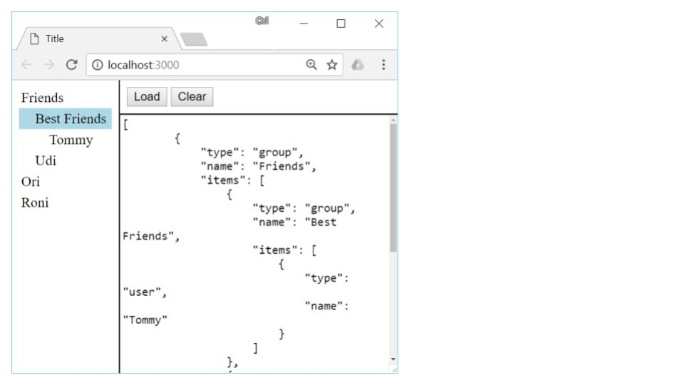

<strong>Assignment 03 &ndash; Chat Tree Component</strong>

During this assignment you are requested to develop a tree UI component using vanilla DOM/jQuery API. The tree component displays all users and groups inside the chat application. Later, we will integrate this component into a full Angular application.

Download the starter code for this assignment from our Github repository at <a href="https://github.com/Trainologic/JSBootcamp3/tree/master/assignments/Assignment%2003/src">https://github.com/Trainologic/JSBootcamp3/tree/master/assignments/Assignment%2003/src</a>

Once downloaded, you should execute <strong>npm install</strong> followed by <strong>npm start</strong>. The following page will be displayed

    

Inside the right pane there is a sample of a JSON structure that can be loaded into the tree using the <strong>load</strong> method. Please explore the JSON and ensure you understand its structure

Once clicking the <strong>Load</strong> button, the JSON content is loaded into the tree component creating the following user interface

    



The end user can navigate through the user/group hierarchy. The following navigation commands are supported

<h2>&nbsp;</h2>

<strong>Clicking a group/user</strong> &ndash; Clicking a group or user node selects this node. A selection is displayed as a rectangular background around the node. For example, after clicking the <strong>Ori</strong> node the tree looks like

    

<h2>&nbsp;</h2>

<strong>Double clicking a group node</strong> &ndash; Double clicking a group node will make it expand or collapse. For example, double clicking the <strong>Friends</strong> node above makes it expand and the tree will look like

    

Double clicking it again will make it collapse again

<strong>Pressing down key</strong> &ndash; Pressing the down key moves the selection one node below. Continue with the above screen shot, pressing the down key changes the selected node from <strong>Friends</strong> to <strong>Best Friends</strong>

    

<strong>Pressing up key</strong> &ndash; Pressing the up key moves the selection one node above. 



<strong>Pressing right key - </strong>Pressing the right key on a group node makes that group expand. Pressing the same key on a user node has no effect. Continue with our above screen shot, pressing the right key makes the <strong>Best Friends</strong> group expand

    

<strong>Pressing left key</strong> &ndash; Pressing a left key on a group node makes that group collapse. If the group is already collapsed than the selection moves to the parent node. For example, continue with above screen shot, pressing left key makes the <strong>Best Friends</strong> node to collapse and pressing left key again makes the selection move to the <strong>Friends</strong> node

<strong>Pressing enter &ndash; </strong>Has no effect when pressed on a user node. However, when pressed on a group node it makes that group expand/collapse. If it is collapsed, it will be expanded and vice versa 

<h2>  </h2>